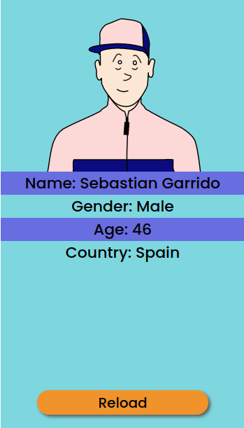

# Random Person

### Languages that are used:

 

### API that are used:
 
1: [Random Person][rp]

2: [Joeschmoe][joeschmoe]

 

### Description:
This project i made for learning API calling, fetch() function in JS.
I started this Project on 20/1/2021 Wednesday.

### Other:
if you have any other idea to add in this project you can folk it and make more interactive.

[rp]:https://randomuser.me/api/
[joeschmoe]:https://joeschmoe.io
